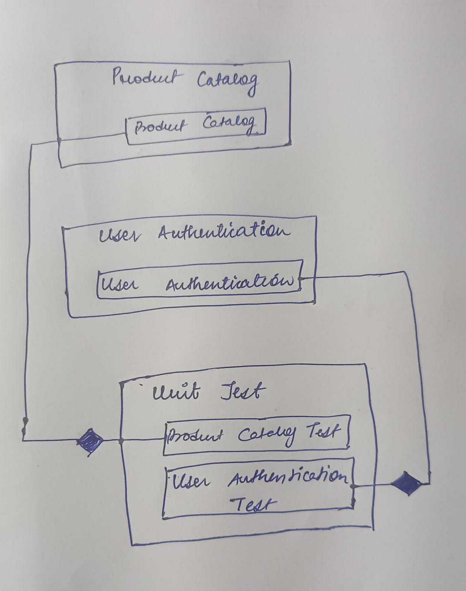

# Prototype Design Pattern Overview

## What is the Prototype Pattern?

The Prototype design pattern is a creational design pattern used in software development. It is employed to create new objects by copying an existing object, known as the prototype. This pattern is particularly useful when the cost of creating a new instance of an object is more expensive than copying an existing instance.

### Key Concepts

1. **Prototype**: An interface or abstract class that declares a method for cloning itself.
2. **Concrete Prototype**: Implements the cloning method and defines the exact prototype to copy.
3. **Client**: Uses the prototype to create new objects by copying the existing prototype.

### Benefits

- **Efficiency**: Reduces the overhead of object creation by cloning an existing instance.
- **Flexibility**: Allows for the creation of complex objects with a known structure.
- **Encapsulation**: Keeps the details of object creation hidden from the client.

## Explanation of Provided Code

### ProductCatalog Class

The `ProductCatalog` class manages a collection of products in an e-commerce system. Here is a detailed explanation of its functionalities:

1. **Data Members**:

   - `private List<Product> products;`: A private list to store the products in the catalog.

2. **Constructor**:

   - `public ProductCatalog()`: Initializes an empty list of products.

3. **Public Methods**:

   - `public bool AddProduct(string name, double price)`: Adds a new product to the catalog. Each product is given a unique ID based on the current count of products. Returns `true` if the product is added successfully.
   - `public bool RemoveProduct(int productId)`: Removes a product by its ID. Returns `true` if the product is found and removed; otherwise, `false`.
   - `public List<Product> ListProducts()`: Returns the list of all products in the catalog.
   - `public List<Product> SearchProduct(string name)`: Searches for products whose names contain the specified substring (case-insensitive). Returns a list of matching products.

4. **Private Class**:
   - `private class Product`: Represents a product with `Id`, `Name`, and `Price` properties.

### UserAuthentication Class

The `UserAuthentication` class handles user registration and authentication in the e-commerce system. Here is a detailed explanation of its functionalities:

1. **Data Members**:

   - `private Dictionary<string, string> users;`: A dictionary to store usernames and passwords.

2. **Constructor**:

   - `public UserAuthentication()`: Initializes an empty dictionary for user credentials.

3. **Public Methods**:
   - `public bool RegisterUser(string username, string password)`: Registers a new user with a given username and password. Returns `true` if the user is registered successfully (i.e., the username is not already taken); otherwise, `false`.
   - `public bool AuthenticateUser(string username, string password)`: Authenticates a user by checking the provided username and password against the stored credentials. Returns `true` if the authentication is successful; otherwise, `false`.
   - `public List<string> ListUsers()`: Returns a list of all registered usernames.

### Summary

The `ProductCatalog` class provides functionalities for managing products, including adding, removing, listing, and searching products. The `UserAuthentication` class manages user registration and authentication, ensuring that only registered users can access certain features. Both classes demonstrate common practices in managing state and behavior in software systems.

By using these classes, you can handle product and user management efficiently in an e-commerce application, providing a foundation for building more complex features and functionalities.

